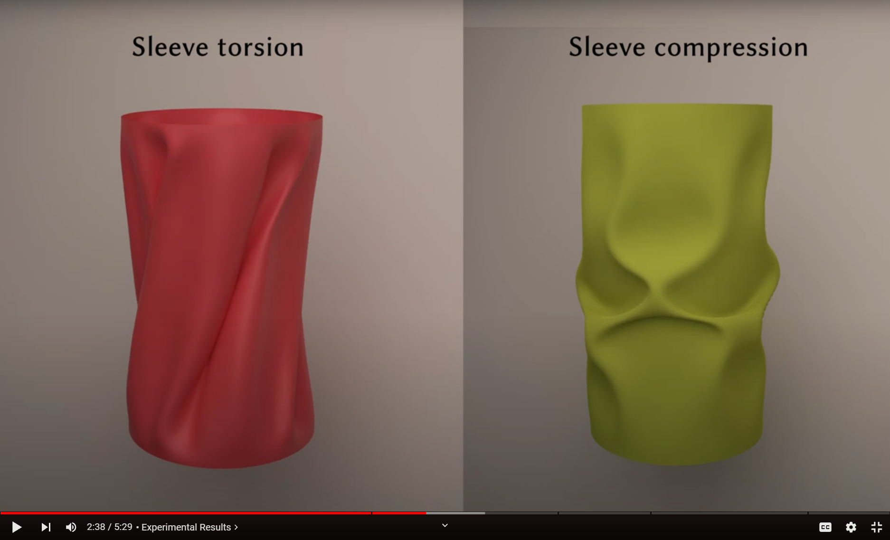

# NeuralClothSim: Neural Deformation Fields Meet the Thin Shell Theory
### [Project Page](https://4dqv.mpi-inf.mpg.de/NeuralClothSim/) | [Paper](https://arxiv.org/pdf/2308.12970) | [Video](https://www.youtube.com/watch?v=z-7MBiAi7SM) 
[](https://colab.research.google.com/github/navamikairanda/neuralclothsim/blob/main/neuralclothsim.ipynb)<br>

[Navami Kairanda](https://people.mpi-inf.mpg.de/~nkairand/),
[Marc Habermann](https://people.mpi-inf.mpg.de/~mhaberma/),
[Christian Theobalt](https://people.mpi-inf.mpg.de/~theobalt/),
[Vladislav Golyanik](https://people.mpi-inf.mpg.de/~golyanik/) <br>
Max Planck Institute for Informatics <br>

### !!!UNDER CONSTRUCTION!! PLEASE WAIT FOR THIS MESSAGE TO GO AWAY BEFORE YOU USE THE REPO!!! ###
This repository contains the official implementation of the paper "NeuralClothSim: Neural Deformation Fields Meet the Thin Shell Theory".

[](https://www.youtube.com/watch?v=z-7MBiAi7SM)

## What is NeuralClothSim?
*Despite existing 3D cloth simulators producing realistic results, they predominantly operate on discrete surface representations (e.g. points and meshes) with a fixed spatial resolution, which often leads to large memory consumption and resolution-dependent simulations. Moreover, back-propagating gradients through the existing solvers is difficult, and they hence cannot be easily integrated into modern neural architectures. In response, this paper re-thinks physically plausible cloth simulation: We propose NeuralClothSim, i.e., a new quasistatic cloth simulator using thin shells, in which surface deformation is encoded in neural network weights in the form of a neural field. Our memory-efficient solver operates on a new continuous coordinate-based surface representation called neural deformation fields (NDFs); it supervises NDF equilibria with the laws of the non-linear Kirchhoff-Love shell theory with a non-linear anisotropic material model. NDFs are adaptive: They 1) allocate their capacity to the deformation details and 2) allow surface state queries at arbitrary spatial resolutions without re-training. We show how to train NeuralClothSim while imposing hard boundary conditions and demonstrate multiple applications, such as material interpolation and simulation editing. The experimental results highlight the effectiveness of our continuous neural formulation.*

## News
* [2024-TODO] We have released the codebase for NeuralClothSim. 

## Installation
Clone this repository to `${code_root}`. The following sets up a new conda environment with all NeuralClothSim dependencies

```
conda create --name neuralclothsim python=3.10
conda activate neuralclothsim

conda install pytorch torchvision pytorch-cuda=11.8 -c pytorch -c nvidia
conda install -c fvcore -c iopath -c conda-forge fvcore iopath
conda install pytorch3d -c pytorch3d
conda install tensorboard matplotlib imageio natsort configargparse
pip install iopath==0.1.10
```

Alternatively, you can setup conda using the from the `environment.yml` file
```
conda env create -f environment.yml
conda activate neuralclothsim
```

## Usage

### High-level overview

The codebase has the following structure:

* Simulation configurations are defined in the `config/` directory. They include the scene description such as reference geometry, boundary condition, and external forces, as well as optimization configuration (e.g. learnign rate) and testing configurations such as sampling rate. 
* Material configutations are defined in the `material/` directory. Material models (linear, nonlinear, StVK, Clyde model etc..) are defined in `material/material.py`.
* Starting point for the running is `run_neuralclothsim.py` and includes both training and testing scripts.
* `modules.py` contains the implementation of the neural deformation field and the boundary conditions.
* `internal_energy.py` contains the implementation of the internal energy of the cloth.
* `reference_midsurface.py` and `reference_geometry.py` contain the implementation of the reference midsurface of the cloth and the derived differential quantities.
* `sampler.py` contains the implementation of the sampler (uniform and mesh-based) for the cloth.

### Running
For full version, check out run_neuralclothsim.py, reproduce simulations with

<details>
<summary><span style="font-weight: bold;">Command line arguments for run_neuralclothsim.py</span></summary>


  #### --source_path / -s
  Path to the source directory containing a COLMAP or Synthetic NeRF data set.

</details>

#### Napkin
```
python run_neuralclothsim.py -c config/drape.ini -n drape_nl_canvas -m material/canvas.ini
python run_neuralclothsim.py -c config/drape.ini -n drape_linear -m material/linear_1.ini
python run_neuralclothsim.py -c config/napkin.ini --expt_name napkin -m material/canvas.ini
```

```
python run_neuralclothsim.py -c config/flag_mesh.ini --expt_name flag_mesh_vis_tangents
python run_neuralclothsim.py -c config/sleeve_buckle.ini -n sleeve_buckle_canvas -m material/canvas.ini
python run_neuralclothsim.py -c config/skirt_twist.ini -n skirt_twist -m material/linear_1.ini
python run_neuralclothsim.py -c config/skirt_static_rim.ini -n skirt_static_rim -m material/canvas.ini
```

#### Reference mesh
```
python run_neuralclothsim.py -c config/napkin_mesh.ini --expt_name napkin_mesh
```

#### Collision
```
python run_neuralclothsim.py -c config/collision.ini -n collision_linear -m material/linear_1.ini
```

```
tensorboard --logdir logs
```


Similarly, replacing `napkin` with `sleeve` or `skirt` will reproduce the corresponding simulations.

### Visualisation

To visualise the trained models, run the following command:
```
python test.py -c config/drape.ini -n drape_nl_canvas -m material/canvas.ini
```

TODO: Share some trained checkpoints

TODO: Add visual result similar to PhysGaussian

## Create Your Own Simulation

Reproducible results by setting the random seed
Mention the required arguments
config file
boundary_condition (not required if collision)
use exisiting material or create new material


## FAQ

- *I am running out of GPU memory, what do I do?* The GPU memory consumption is determined by the number of samples drawn from the reference midsurface. You can reduce the number of samples in the `config/*.ini` file.
- *How did we generate UV map for single panel (piece of cloth rather than a garment)?* Blender step; Import mesh, UV Editing, Edit model, UV unwrap (angle-based), export mesh as .obj with uv. Delete .mtl file. Veryify using Set Texture

## Acknowledgements
This codebase used lots of source code from:

https://github.com/vsitzmann/siren

We thank the authors of these projects.

## Citation

If you use this code for your research, please cite:
```
@article{kair2023neuralclothsim, 
	title={NeuralClothSim: Neural Deformation Fields Meet the Thin Shell Theory}, 
	author={Navami Kairanda and Marc Habermann and Christian Theobalt and Vladislav Golyanik}, 
	journal = {arXiv:2308.12970v2}, 
	year={2023} 
}
```
