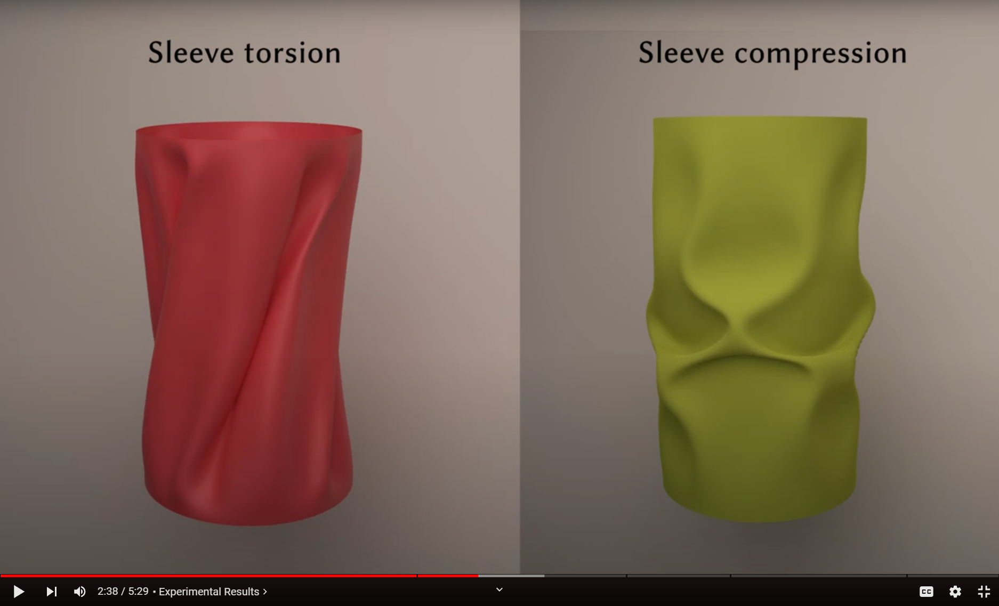

# NeuralClothSim: Neural Deformation Fields Meet the Thin Shell Theory
### [Project Page](https://4dqv.mpi-inf.mpg.de/NeuralClothSim/) | [arXiv](https://arxiv.org/pdf/2308.12970) | [Video](https://www.youtube.com/watch?v=z-7MBiAi7SM) 
[](https://colab.research.google.com/github/navamikairanda/neuralclothsim/blob/main/neuralclothsim.ipynb)<br>

[Navami Kairanda](https://people.mpi-inf.mpg.de/~nkairand/),
[Marc Habermann](https://people.mpi-inf.mpg.de/~mhaberma/),
[Christian Theobalt](https://people.mpi-inf.mpg.de/~theobalt/),
[Vladislav Golyanik](https://people.mpi-inf.mpg.de/~golyanik/) <br>
Max Planck Institute for Informatics <br>

### !!!UNDER CONSTRUCTION!! PLEASE WAIT FOR THIS MESSAGE TO GO AWAY BEFORE YOU USE THE REPO!!! ###
This repository contains the official implementation of the paper "NeuralClothSim: Neural Deformation Fields Meet the Thin Shell Theory".

[](https://www.youtube.com/watch?v=z-7MBiAi7SM)

## What is NeuralClothSim?
*Despite existing 3D cloth simulators producing realistic results, they predominantly operate on discrete surface representations (e.g. points and meshes) with a fixed spatial resolution, which often leads to large memory consumption and resolution-dependent simulations. Moreover, back-propagating gradients through the existing solvers is difficult, and they hence cannot be easily integrated into modern neural architectures. In response, this paper re-thinks physically plausible cloth simulation: We propose NeuralClothSim, i.e., a new quasistatic cloth simulator using thin shells, in which surface deformation is encoded in neural network weights in the form of a neural field. Our memory-efficient solver operates on a new continuous coordinate-based surface representation called neural deformation fields (NDFs); it supervises NDF equilibria with the laws of the non-linear Kirchhoff-Love shell theory with a non-linear anisotropic material model. NDFs are adaptive: They 1) allocate their capacity to the deformation details and 2) allow surface state queries at arbitrary spatial resolutions without re-training. We show how to train NeuralClothSim while imposing hard boundary conditions and demonstrate multiple applications, such as material interpolation and simulation editing. The experimental results highlight the effectiveness of our continuous neural formulation.*

## News
* [12.09.2024] We have released the source code for NeuralClothSim. 

## Installation
Clone this repository to `${code_root}`. The following sets up a new conda environment with all NeuralClothSim dependencies.

```
conda create --name neuralclothsim python=3.10
conda activate neuralclothsim

conda install pytorch torchvision pytorch-cuda=11.8 -c pytorch -c nvidia
conda install -c fvcore -c iopath -c conda-forge fvcore iopath
conda install pytorch3d -c pytorch3d
conda install tensorboard matplotlib imageio natsort configargparse
pip install iopath==0.1.10
```

Alternatively, you can setup conda using the from the `environment.yml` file
```
conda env create -f environment.yml
conda activate neuralclothsim
```

## Usage

### High-level Overview

The codebase has the following structure:
* Simulation configurations are defined in the `config/` directory. They include the scene description, such as reference geometry, boundary condition, external forces, optimisation configuration (e.g. learning rate), and testing configurations, such as sampling rate. 
* Material configurations are defined in the `material/` directory. Material models (linear, nonlinear, StVK, Clyde model etc..) and their corresponding strain energy computations are defined in `material.py`.
* The entry point for running the method is `run_neuralclothsim.py`, which includes training and testing scripts.
* `modules.py` contains the implementation of the neural deformation field, and `boundary.py` contains the Dirichlet and periodic boundary constraints.
* `energy.py` computes the loss, i.e. potential energies of the simulation system, and `strain.py` includes the calculation of stretching and bending strain. 
* `reference_midsurface.py` and `reference_geometry.py` contain the implementation of the reference midsurface of the thin shell (cloth) and the derived differential quantities.
* `sampler.py` generates grid or mesh-based training samples on the cloth.

### Running Code
Check out `run_neuralclothsim.py` for reproducing simulations. It includes both training (solving physics to train NDF) and testing (extracting simulated meshes from the NDF) scripts. For training, simply use 
```
python run_neuralclothsim.py -c config/{config_file_name}.ini -n {expt_name}
```
and for evaluation 
```
python run_neuralclothsim.py -c config/{config_file_name}.ini -n {expt_name} --test_only --i_ckpt {trained_checkpoint}
```

The exact usage details and all arguments can be found with
```
python run_neuralclothsim.py --help 
``` 
The logs, including simulated meshes and checkpoints, will be accessible at `logging_dir`. Further, to debug and monitor progress, the training code writes summaries to the tensorboard, which can be viewed with
```
tensorboard --logdir {logging_dir}
```

#### Napkin 
The napkin experiments, i.e. a square cloth subject to gravity under different boundary conditions such as a fixed corner handle, two corner handles moving inwards or with fixed edges can be reproduced with:
```
python run_neuralclothsim.py -c config/napkin_fixed_handle.ini 
python run_neuralclothsim.py -c config/napkin_moving_handles.ini
python run_neuralclothsim.py -c config/napkin_fixed_edges.ini
```

#### Sleeve
To perform sleeve compression and torsion with a cylindrical shell, run:
```
python run_neuralclothsim.py -c config/sleeve_buckle.ini
python run_neuralclothsim.py -c config/sleeve_twist.ini
```

#### Skirt
Further, the experimental results of a skirt under gravity with a fixed or twisted waist can be generated with:
```
python run_neuralclothsim.py -c config/skirt_fixed_waist.ini
python run_neuralclothsim.py -c config/skirt_twist.ini
```

#### Reference mesh
Apart from the analytical surfaces above, one could simulate starting from an artitrary template mesh. In this case, remember to include the source mesh path with ` reference_geometry_source` and boundary condition with `reference_boundary_vertices`:
```
python run_neuralclothsim.py -c config/napkin_mesh_fixed_handle.ini
python run_neuralclothsim.py -c config/arbitrary_mesh_blender.ini
```

#### Varying material
You can specify the material of your choice using `-m material/{material_name}.ini` for any of the above experiments. Moreover, one could specify `--StVK` for St. Venant-Kirchoff material. For example,
```
python run_neuralclothsim.py -c config/napkin_moving_handles.ini --expt_name napkin_canvas_stvk -m material/canvas.ini --StVK
python run_neuralclothsim.py -c config/napkin_moving_handles.ini --expt_name napkin_silk -m material/silk.ini
```

## FAQ

- *I am running out of GPU memory, what do I do?* The GPU memory consumption is determined by the number of samples drawn from the reference midsurface. You can reduce the number of samples for training in the `config/*.ini` file.


## Acknowledgements
This repository uses some of the source code from:

https://github.com/vsitzmann/siren

We thank the authors of this project.

## Citation

If you use this code for your research, please cite:
```
@article{kair2023neuralclothsim, 
	title={NeuralClothSim: Neural Deformation Fields Meet the Thin Shell Theory}, 
	author={Navami Kairanda and Marc Habermann and Christian Theobalt and Vladislav Golyanik}, 
	journal = {arXiv:2308.12970v2}, 
	year={2023} 
}
```

## License
This software is provided freely for non-commercial use. We release this code under the MIT license, which you can find in the file LICENSE.